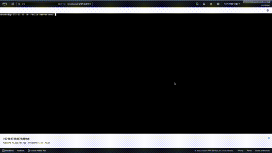
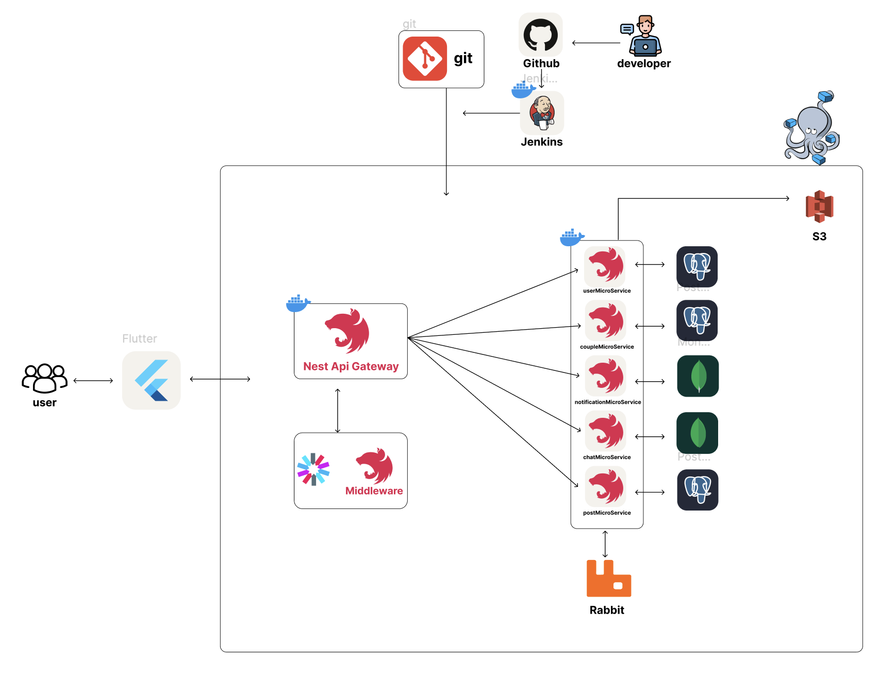
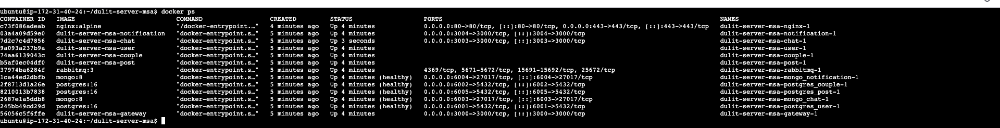
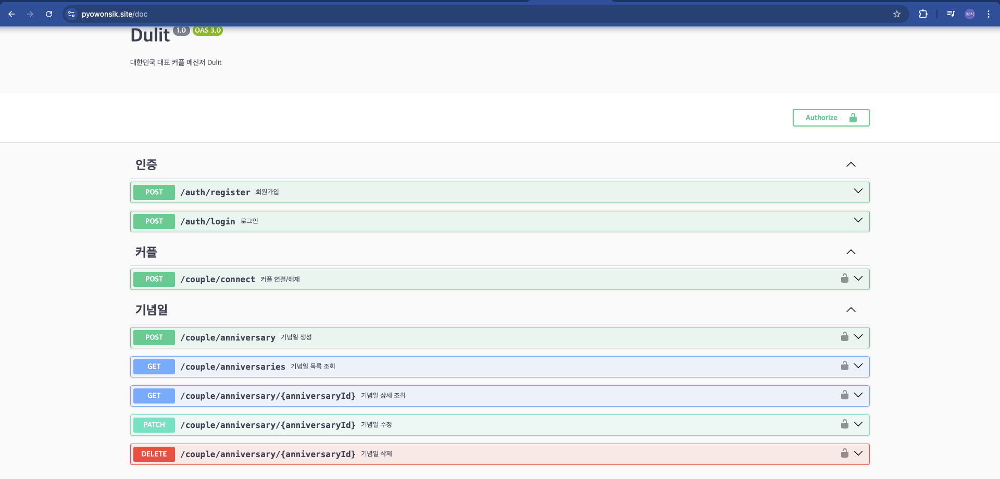

# 둘잇 (Dulit) - 커플 전용 앱 백엔드 서버

NestJS + MSA 기반 커플 전용 애플리케이션 백엔드 서버

실시간 채팅, 기념일/약속 관리, 데이트 코스 공유 기능 제공

## 데모

<p align="center">
  
</p>

## 시스템 아키텍처



## AWS EC2 배포



> **Note**: 인스턴스 비용으로 인해 현재 EC2 서버는 중지된 상태입니다.
> 모놀리식 버전으로 배포된 서버는 [Dulit-server](https://github.com/pyowonsik/Dulit-server)에서 확인하실 수 있습니다.

## API 문서 (Swagger)



## 주요 기능

- 카카오 소셜 로그인 (OAuth2 + JWT)
- 실시간 커플 채팅 (Socket.IO)
- 기념일 & 약속 관리 (D-Day 자동 계산)
- 데이트 캘린더
- 커뮤니티 게시판 (데이트 코스 공유)
- 실시간 알림 (매칭, 약속 리마인더)

## 기술 스택

**Backend**: NestJS, TypeScript, Node.js

**Database**: PostgreSQL, MongoDB, TypeORM, Mongoose

**Message Broker**: RabbitMQ

**Auth**: OAuth2, JWT, Passport

**Real-time**: Socket.IO, WebSocket

**DevOps**: Docker, Docker Compose

## 마이크로서비스 구성

| 서비스         | 포트 | 데이터베이스 | 역할                     |
| -------------- | ---- | ------------ | ------------------------ |
| Gateway        | 3000 | -            | API Gateway, 인증/인가   |
| User Service   | -    | PostgreSQL   | 사용자 관리, 소셜 로그인 |
| Couple Service | -    | PostgreSQL   | 커플 매칭, 기념일, 약속  |
| Chat Service   | 3003 | MongoDB      | 실시간 채팅              |
| Post Service   | -    | PostgreSQL   | 커뮤니티 게시글          |
| Notification   | 3004 | MongoDB      | 실시간 알림              |

## 실행 방법

```bash
# Docker Compose로 전체 서비스 실행
docker-compose up -d

# 개별 서비스 실행
pnpm run start:dev gateway
pnpm run start:dev user
pnpm run start:dev couple
pnpm run start:dev chat
pnpm run start:dev post
pnpm run start:dev notification
```

## 개발

- **개발자**: 표원식 (1인 개발)
- **아키텍처**: Monolithic → MSA 마이그레이션

## 라이센스

MIT License
